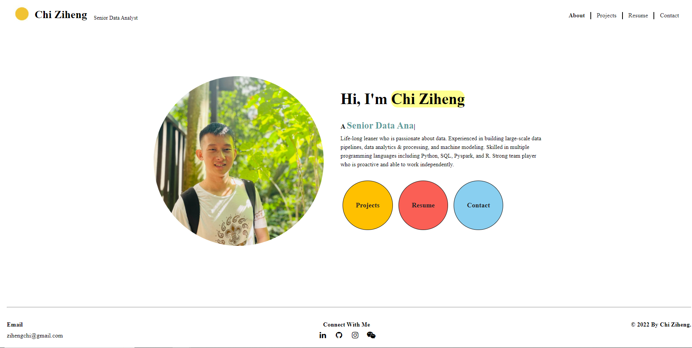

# Portfolio Website⚡️ 
> A interactive, minimalistic portfolio template for everyone!

> https://ziheng-website.as.r.appspot.com

### Website Preview

 
  <kbd>
    
  </kbd>

## Features 📋
⚡️ Frontend: HTML5 & CSS \
⚡️ Backend: Flask \
⚡️ Typing animation using `Typed.js`\
⚡️ Easy to modify & extend

## Run locally 📦
- Clone the repository
- Create python virtual env (python 3.9) to install all packages: `pip install -r requirements.txt`
- Run Flask in the terminal： `flask run`
- Open the url that prompted in the terminal

## Sections 📚
✔️ About\
✔️ Projects\
✔️ Resume\
✔️ Contact 

## Tools Used 🛠️
* [<b>Google Cloud App Engine</b> | <b>Heroku</b>](https://cloud.google.com/appengine) - To host my static website (HTML, CSS, JS, Flask).
* [<b>Flask</b>](https://flask.palletsprojects.com/en/2.2.x/) - Python backend framework.
* [<b>Bootstrap5</b>](https://getbootstrap.com/) - A CSS framework to get beautiful Design components.
* [<b>Typed.js</b>](https://mattboldt.com/demos/typed-js/) - JavaScript Library

## Note
* The Procfile and runtime.txt is needed if you would like to deploy on Heroku. 
* app.yaml is needed if you would like to deploy on GCP App Engine
* Environment variables need to be configured for the contact form to work properly